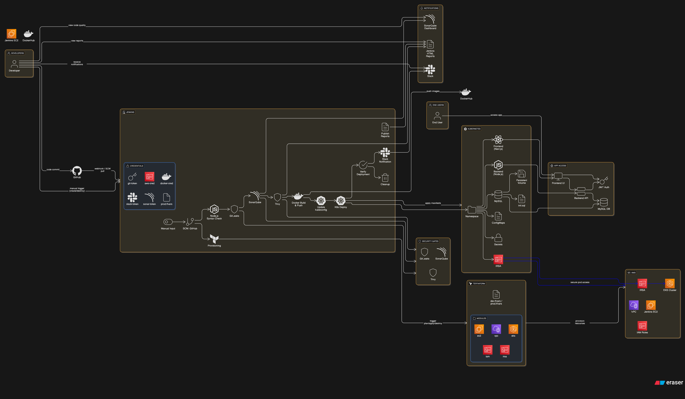
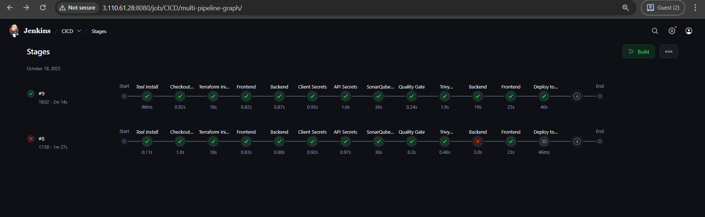

## 🚀 3-Tier DevSecOps Capstone Project — Terraform | Jenkins | Docker | Kubernetes | IRSA

[](https://github.com/Rahul-Kumar-Paswan/DevOps-QR-Generator)
[](https://github.com/Rahul-Kumar-Paswan/DevOps-QR-Generator/graphs/contributors)
[](https://aws.amazon.com/)


---

This project showcases a **production-grade deployment** of a **3-tier full-stack Node.js web application** on **Amazon EKS**, using **Terraform** for infrastructure provisioning, **IRSA** for secure IAM integration, and a robust **Jenkins-based CI/CD pipeline**.

Designed as a **DevSecOps capstone project**, it integrates all core components of a modern delivery workflow — **provisioning, build, test, deploy, scan**.

---

## 🖥️ Project Overview

This project demonstrates a **production-grade 3-tier DevSecOps pipeline**, covering every layer of application delivery — from infrastructure provisioning to secure deployment, code quality, and automated CI/CD.

### 🔧 Application Stack

- ✅ **Frontend**: Built with **Next.js** for modern, responsive user interface
- ✅ **Backend**: RESTful API built using **Node.js** and **Express**
- ✅ **Database**: (Add if used — e.g., MongoDB/PostgreSQL hosted on RDS or locally)
- ✅ **Storage**: AWS **S3** used for storing QR codes or uploaded assets

### 🧱 Infrastructure

- ✅ Provisioned using **modular Terraform** (VPC, EKS, IAM roles, etc.)
- ✅ Deployed to **Amazon EKS** (Elastic Kubernetes Service)
- ✅ Secured using **IRSA (IAM Roles for Service Accounts)** — no static credentials
- ✅ Configured using **Kubernetes-native resources** like Deployments, Services, ConfigMaps, and Secrets

### ⚙️ CI/CD Pipeline (Jenkins)

- ✅ Built and deployed using **Jenkins** pipeline hosted on **AWS EC2**
- ✅ Pipeline automates:
  - Infrastructure provisioning (`terraform apply/destroy`)
  - Docker image build and push to registry
  - Kubernetes deployment using `kubectl`
  - Full application lifecycle: **Build → Test → Scan → Deploy**
- ✅ Triggered via **manual parameters** or **GitHub webhook (push/merge)**

### 🔐 DevSecOps & Quality Integrations

- ✅ **SonarQube** integration for static code analysis and code quality gates
- ✅ **Trivy** scanning for container vulnerabilities at every image build
- ✅ **GitLeaks** used to detect accidental secrets in Git history
- ✅ **Slack notifications** integrated into Jenkins pipeline for live build alerts
- ✅ Maintains **clean, reproducible Node.js environments** with `.nvmrc` or Dockerized Node base

---

## 🧱 Architecture / Workflow


---

## 🧭 Table of Contents

- [🚀 3-Tier DevSecOps Capstone Project](#-3-tier-devsecops-capstone-project-terraform--jenkins--docker--kubernetes--irsa)
- [🖥️ Project Overview](#️-project-overview)
  - [🔧 Application Stack](#-application-stack)
  - [🧱 Infrastructure](#-infrastructure)
  - [⚙️ CI/CD Pipeline (Jenkins)](#-cicd-pipeline-jenkins)
  - [🔐 DevSecOps & Quality Integrations](#-devsecops--quality-integrations)
- [🧱 Architecture / Workflow](#-architecture--workflow)
- [✨ Features](#-features)
  - [🧩 Application](#-application)
  - [🔐 Security & Code Quality](#-security--code-quality)
  - [⚙️ CI/CD & Automation](#-cicd--automation)
  - [☸️ Kubernetes & Scalability](#-kubernetes--scalability)
- [🧰 Tech Stack](#-tech-stack)
- [⚙️ Prerequisites](#-prerequisites)
  - [🧰 Tools & Software](#-tools--software)
  - [🔐 Access & Accounts](#-access--accounts)
- [📂 Project Structure](#-project-structure)
- [🖥️ Jenkins Server EC2 Setup (CI/CD Host)](#️-jenkins-server-ec2-setup-cicd-host)
- [🛠️ Local Development](#️-local-development)
  - [🔧 Frontend (React / Next.js)](#-frontend-react--nextjs)
  - [🧪 Backend (FastAPI)](#-backend-fastapi)
- [🐳 Docker Setup (Dev + Prod)](#-docker-setup-dev--prod)
  - [🐳 Build Backend Image](#-build-backend-image)
  - [🐳 Build Frontend Image](#-build-frontend-image)
  - [🐳 Docker Compose (Optional)](#-docker-compose-optional)
- [🏗️ Infrastructure (Terraform)](#️-infrastructure-terraform)
- [☸️ Kubernetes Deployment (EKS Cluster)](#️-kubernetes-deployment-eks-cluster)
  - [✅ Namespace Creation](#-namespace-creation)
  - [✅ Deploy Kubernetes Manifests](#-deploy-kubernetes-manifests)
    - [🔐 Secrets](#-secrets)
    - [⚙️ ConfigMaps](#-configmaps)
    - [🚀 Deployments](#-deployments)
  - [🔍 Verify Deployments](#-verify-deployments)
- [⚡ Jenkins CI/CD Pipeline](#️-jenkins-cicd-pipeline)
  - [🚀 Trigger Options](#-trigger-options)
    - [🔘 Manual Trigger (via Jenkins UI)](#-manual-trigger-via-jenkins-ui)
    - [🔁 Automatic Trigger (via GitHub Webhook)](#-automatic-trigger-via-github-webhook)
  - [🔧 GitHub Webhook Setup](#-github-webhook-setup)
  - [⚙️ Jenkins Job Configuration](#-jenkins-job-configuration)
  - [📋 Jenkinsfile Overview](#-jenkinsfile-overview)
- [🔧 Plugins & Tools Used](#-plugins--tools-used)
- [Environment Variables](#environment-variables)
- [Jenkins Parameters](#jenkins-parameters)
- [Pipeline Stages](#pipeline-stages)
- [Notifications & Reports](#notifications--reports)
- [🔐 Tokens & Credentials in Jenkins](#-tokens--credentials-in-jenkins)
- [🔧 Tools Configuration](#-tools-configuration)

### Integrations

- [🔔 Slack Integration (Build Notifications)](#-slack-integration-build-notifications)
- [🔍 SonarQube Integration (Code Quality)](#-sonarqube-integration-code-quality)
- [🧪 Trivy Integration (Security Scanning)](#-trivy-integration-security-scanning)
- [🔐 GitLeaks Integration (Secret Detection)](#-gitleaks-integration-secret-detection)
- [✅ Jenkins Quality Gate Plugin (for SonarQube)](#-jenkins-quality-gate-plugin-for-sonarqube)
- [🧱 Node.js Setup (for JS-based Projects)](#-nodejs-setup-for-js-based-projects)
- [Optional: Manual NodeJS Setup](#optional-manual-nodejs-setup)

---

- [📊 Tool Summary](#-tool-summary)
- [🔒 Security & Best Practices](#-security--best-practices)
- [💰 Cost Optimization](#-cost-optimization)
- [📝 Environment Variables](#️-environment-variables-1)
- [📸 Screenshots / Demo](#️-screenshots--demo)
- [📚 Learning / Takeaways](#️-learning--takeaways)
- [📌 TODO / Future Enhancements](#️-todo--future-enhancements)
- [🤝 Contributing](#️-contributing)
- [📝 License](#️-license)


---

## ✨ Features

### 🧩 Application

- ✅ Full-stack **Node.js application** with clean, scalable architecture
- ✅ **Next.js frontend** for responsive UI and user interaction
- ✅ **JWT-based authentication** with role-based access (Admin / Viewer)
- ✅ **Token-based middleware** for secure backend route protection
- ✅ **MySQL database** with preloaded schema using `init.sql`
- ✅ Clean environment setup using `.nvmrc` or Dockerized Node images

---

### 🔐 Security & Code Quality

- ✅ **Static code analysis** using **SonarQube** with enforced quality gates
- ✅ **Container vulnerability scanning** with **Trivy**
- ✅ **Secret detection** using **GitLeaks** to avoid credential leaks
- ✅ Kubernetes **Secrets** and **ConfigMaps** used for sensitive data
- ✅ Follows **DevSecOps** principles with scanning and feedback at every stage

---

### ⚙️ CI/CD & Automation

- ✅ Fully automated **CI/CD pipeline** using **Jenkins on EC2**
- ✅ Modular `Jenkinsfile` with stages: Build → Test → Scan → Deploy
- ✅ Docker container builds for backend and frontend apps
- ✅ Slack integration for **real-time build notifications**
- ✅ Supports both **manual and GitHub webhook triggers**

---

### ☸️ Kubernetes & Scalability

- ✅ Fully containerized architecture: **Backend**, **Frontend**, and **Database**
- ✅ Modular and reusable **Kubernetes YAML manifests**
- ✅ Service discovery using **Kubernetes DNS**
- ✅ Persistent database storage using **PVCs (PersistentVolumeClaims)**
- ✅ Works on both **Minikube** (local) and **Amazon EKS** (cloud)
- ✅ **IRSA integration** for secure access to AWS services from within pods

---

## 🧰 Tech Stack

| Layer       | Tools & Technologies                                                                 |
|-------------|----------------------------------------------------------------------------------------|
| Frontend    | Next.js, React, HTML5, CSS3                                                           |
| Backend     | Node.js, Express.js, JWT                                                              |
| Database    | MySQL (with init.sql), Persistent Volume via Kubernetes PVC                           |
| DevOps      | Docker, Jenkins, Git, SonarQube, Trivy, GitLeaks, Slack Notifications                 |
| Kubernetes  | Amazon EKS, kubectl, YAML (Deployments, Services, ConfigMaps, Secrets)                |
| Cloud       | AWS (EKS, S3, IAM, IRSA, OIDC), EC2 (for Jenkins Host)                                |
| CI/CD       | Jenkins (Pipeline-as-Code), GitHub Webhooks, Slack Integration                        |
| IaC         | Terraform (modular setup: VPC, EKS, IAM roles, etc.), eksctl                          |

---

## ⚙️ Prerequisites

Before you start, ensure you have the following **tools** installed and **access** configured.

---

### 🧰 Tools & Software

| Tool / Software                                                                    | Purpose                                               |
| ---------------------------------------------------------------------------------- | ----------------------------------------------------- |
| [**Docker**](https://www.docker.com/)                                              | For container builds and image management             |
| [**Node.js (v14+)**](https://nodejs.org/)                                          | Required for backend/frontend development & testing   |
| [**Jenkins**](https://www.jenkins.io/)                                             | CI/CD automation (used for build, test, scan, deploy) |
| [**kubectl**](https://kubernetes.io/docs/tasks/tools/)                             | Kubernetes command-line tool                          |
| [**Minikube**](https://minikube.sigs.k8s.io/docs/) **or** EKS / GKE / AKS          | For local or cloud-based Kubernetes clusters          |
| Docker Registry *(e.g., [Docker Hub](https://hub.docker.com/), ECR)*               | Push/pull container images                            |
| [**Terraform CLI**](https://developer.hashicorp.com/terraform/downloads)           | Infrastructure provisioning via code (IaC)            |
| [**AWS CLI**](https://docs.aws.amazon.com/cli/latest/userguide/install-cliv2.html) | Manage AWS infrastructure & EKS connectivity          |

---

### 🔐 Access & Accounts

| Access / Service                  | Purpose                                           |
| --------------------------------- | ------------------------------------------------- |
| **Slack Workspace + Webhook URL** | For real-time Jenkins pipeline notifications      |
| **SonarQube Server + Token**      | For static code quality & vulnerability scanning  |
| **GitHub Repository Access**      | With webhook enabled for automated build triggers |
| **AWS IAM with IRSA Configured**  | Secure IAM Roles for Kubernetes workloads         |

> 💡 **Tip:** Make sure your AWS credentials and kubeconfig are properly configured before running the pipeline or deploying to Kubernetes.
 
---

## 📂 Project Structure

```bash
3-Tier-DevSecOps-Project/
├── LICENSE                    # Project license file
├── README.md                  # Main project documentation
├── Infra/                     # Infrastructure as Code (Terraform) and Jenkins pipeline
│   ├── Jenkinsfile            # Jenkins pipeline definition
│   ├── envs/                  # Environment-specific Terraform variables
│   │   ├── dev.tfvars
│   │   └── prod.tfvars
│   ├── main.tf                # Root Terraform configuration
│   ├── modules/               # Terraform reusable modules
│   │   ├── ec2/               # EC2 module for Jenkins host, etc.
│   │   ├── eks/               # EKS cluster and IAM roles
│   │   └── vpcs/              # VPC and networking modules
│   ├── output.tf              # Terraform outputs
│   ├── scripts/               # Setup and utility scripts (e.g., SonarQube setup)
│   ├── terraform.tfvars       # Default Terraform variable values
│   └── variables.tf           # Variable declarations
├── Jenkinsfile                # Jenkins pipeline (root level)
├── api/                       # Backend Node.js application
│   ├── Dockerfile             # Dockerfile to build backend container image
│   ├── app.js                 # Main Express app entry point
│   ├── controllers/           # Route controllers (auth, user management)
│   ├── middleware/            # Middleware for auth and roles
│   ├── models/                # Database connection and models
│   ├── routes/                # API route definitions
│   ├── package.json           # Backend dependencies
│   └── package-lock.json      # Exact versions of dependencies
├── client/                    # Frontend React app
│   ├── Dockerfile             # Dockerfile for frontend container image
│   ├── default.conf.template  # NGINX config template for frontend
│   ├── package.json           # Frontend dependencies
│   ├── package-lock.json      # Exact versions of dependencies
│   ├── public/                # Static assets (favicon, manifest, etc.)
│   └── src/                   # React components, pages, and app logic
├── kubernetes/                # Kubernetes manifests and config files
│   ├── app-configs.yaml       # ConfigMaps and Secrets for apps
│   ├── backend-deployment.yaml # Backend Deployment and Service
│   ├── frontend-deployment.yaml # Frontend Deployment and Service
│   ├── mysql-deployment.yaml  # MySQL StatefulSet and Service
│   ├── mysql-initdb-config.yaml # MySQL initialization ConfigMap
│   ├── mysql-secret.yaml      # MySQL root password secret
│   └── sc.yaml                # StorageClass for persistent volume provisioning
├── screenshots/               # Project-level architecture and UI screenshots
└── server-setup.sh            # AWS Server setup script

```
---
## 🖥️ Jenkins Server EC2 Setup (CI/CD Host)

Provision a `t2.small` (or your preferred) EC2 Ubuntu instance and run:

```bash
chmod +x server-setup.sh
./server-setup.sh
```
This script installs and configures the following tools:

- **Jenkins**
- **Docker** (with permissions for the Jenkins user)
- **AWS CLI**
- **Terraform**
- **kubectl**
- **eksctl**
- **Gitleaks** (secret scanning)
- **Trivy** (container vulnerability scanning)

> **Note:** Reboot the EC2 instance after the setup completes to apply Docker group changes for the Jenkins user.

---
# 🛠️ Local Development

## 🔧 Frontend (React / Next.js)
```bash
cd client
npm install
npm run dev
```
### 🧪 Backend (FastAPI)
```bash
cd api
npm install
npm start
```
---
## 🐳 Docker Setup (Dev + Prod)
### 🐳 Build Backend Image
```bash
cd api
docker build -t <your-backend-image-name> .
```

### 🐳 Build Frontend Image
```bash
cd client
docker build -t <your-frontend-image-name> .
```

### 🐳 Docker Compose (Optional)
```bash
docker-compose up --build
```

---
# 🏗️ Infrastructure (Terraform)

Terraform modules provision everything:

- **VPC** (`modules/vpcs/`)
- **EKS cluster and node groups** (`modules/eks/`)
- **EC2 instances** (SonarQube or others) (`modules/ec2/`)
- **IAM Roles and policies** — attached to node groups or EC2 instance profiles, **not** via Kubernetes ServiceAccounts IRSA.

Usage remains:

```bash
cd Infra/
terraform init
terraform apply -var-file=terraform.tfvars
# or
terraform apply -var-file=envs/dev.tfvars      # for dev environment
# or
terraform apply -var-file=envs/prod.tfvars     # for prod environment
```
---

# ☸️ Kubernetes Deployment (EKS Cluster)

## ✅ Namespace Creation

The Kubernetes namespace (e.g., `prod` or `dev`) is created via Terraform during Infra provisioning.  
You **don't need** to manually create the namespace before applying manifests.

## ✅ Deploy Kubernetes Manifests

Apply the manifests in the appropriate namespace (e.g., `prod`):

```bash
kubectl apply -f kubernetes/mysql-secret.yaml -n prod
kubectl apply -f kubernetes/app-configs.yaml -n prod
kubectl apply -f kubernetes/mysql-initdb-config.yaml -n prod
kubectl apply -f kubernetes/mysql-deployment.yaml -n prod
kubectl apply -f kubernetes/backend-deployment.yaml -n prod
kubectl apply -f kubernetes/frontend-deployment.yaml -n prod
```
---

These manifests include:

### 🔐 Secrets
- `mysql-secret.yaml`  
  Contains MySQL root credentials and JWT secrets for backend authentication.

### ⚙️ ConfigMaps
- `app-configs.yaml`  
  Application configuration for frontend and backend.
  
- `mysql-initdb-config.yaml`  
  Initialization script for MySQL to preload schema and create default users.

### 🚀 Deployments

- `mysql-deployment.yaml`  
  Deploys MySQL as a **StatefulSet** with **Persistent Volume Claims (PVC)** for durable storage.

- `backend-deployment.yaml`  
  Deploys the **Node.js + Express** backend application with environment variables from Secrets and ConfigMaps.

- `frontend-deployment.yaml`  
  Deploys the **React + NGINX** frontend application, connected to the backend via internal service.

---

## 🔍 Verify Deployments

Once applied, check if the resources are running correctly using the following commands:

```bash
# View all resources in the 'prod' namespace
kubectl get all -n prod

# View individual pod logs (backend example)
kubectl logs -n prod deployment/backend

# Port-forward frontend service to access UI
kubectl port-forward svc/frontend-svc -n prod 8080:80
```

---
## ⚡ Jenkins CI/CD Pipeline

This project provides a fully automated CI/CD pipeline using **Jenkins** for deploying and managing infrastructure and applications on **AWS EKS**, featuring:

- ✅ **Manual triggers** via Jenkins UI  
- 🔁 **Automatic triggers** via GitHub Webhooks  
- 🧪 **Static and dynamic code analysis** for quality and security  
- 🔐 **Secure credentials handling** using Jenkins Credentials Plugin  

---

### 🚀 Trigger Options

#### 🔘 Manual Trigger (via Jenkins UI)

1. Go to your Jenkins job.
2. Click **Build with Parameters**.
3. Use the `ACTION` dropdown to select:

   - `create` → Provision infrastructure and deploy the app  
   - `destroy` → Tear down infrastructure and Kubernetes resources

---

#### 🔁 Automatic Trigger (via GitHub Webhook)

CI/CD is triggered **automatically** when:

- 🚀 Code is pushed to the `main` branch  
- 🔀 A pull request is merged into `main`

This is configured using a **GitHub Webhook** integrated with Jenkins.

---

### 🔧 GitHub Webhook Setup

1. ✅ Find your Jenkins public IP or domain:  
   `http://<YOUR_PUBLIC_IP>:8080`

2. ✅ In your GitHub repository, go to:  
   **Settings → Webhooks → Add Webhook**

3. ✅ Fill out the webhook form:

| **Field**        | **Value**                                              |
| ---------------- | ------------------------------------------------------ |
| **Payload URL**  | `http://<YOUR_JENKINS_PUBLIC_IP>:8080/github-webhook/` |
| **Content Type** | `application/json`                                     |
| **Secret**       | *(Optional for added security)*                        |
| **Events**       | ✅ Just the **Push event**                              |

4. ✅ Click **Add Webhook**

5. ✅ After adding, check **Recent Deliveries** → a successful webhook shows:  
   **Response: 200 OK**

---

### ⚙️ Jenkins Job Configuration

1. Open Jenkins Dashboard → your **Pipeline Job**
2. Click **Configure**
3. Under **Build Triggers**, check:  
   ✅ **GitHub hook trigger for GitSCM polling**

4. In **Pipeline Script from SCM**, confirm:

```groovy
git branch: 'main',
url: '<git-repo>'
```
- ✅ This ensures Jenkins always pulls the latest code from the main branch whenever a push or PR merge occurs.

---
## 🔧 Plugins & Tools Used

| Tool / Plugin                 | Purpose                                 |
| ----------------------------- | --------------------------------------- |
| Jenkins Pipeline              | Pipeline orchestration                  |
| GitHub                        | Source code repository integration      |
| Docker                        | Containerization                        |
| Docker Pipeline & Build Step  | Docker image build and push in pipeline |
| AWS Credentials Plugin        | Secure AWS credentials management       |
| Kubernetes Plugin             | Kubernetes integration in Jenkins       |
| Kubernetes CLI Plugin         | Kubernetes CLI commands support         |
| Kubernetes Credentials Plugin | Kubernetes authentication management    |
| Slack Notification Plugin     | Send CI/CD notifications to Slack       |
| SonarQube Scanner Plugin      | Code quality and static analysis        |
| HTML Publisher Plugin         | Publish reports (e.g., HTML reports)    |
| NodeJS Plugin                 | Node.js runtime support in Jenkins      |
| Stage View Plugin             | Visualize pipeline stages and progress  |
| SonarQube                     | Code quality analysis tool              |
| Trivy                         | Container vulnerability scanning        |
| GitLeaks                      | Secret detection in source code         |
| Node.js                       | Runtime for frontend/backend builds     |
| Terraform                     | Infrastructure as Code                  |
| Kubectl                       | Kubernetes deployment and management    |

---

## Your Jenkins Pipeline Automates:

- **Manual control:** Select `create` or `destroy` infrastructure using a Jenkins parameter.
- **Source Code Management:** Checkout from GitHub repository (branch: `testing`).
- **Infrastructure Provisioning:**  
  - Runs Terraform to create/destroy AWS resources after checkout.
  - Uses secure AWS credentials and Terraform variable files.
- **Code Syntax Validation:**  
  - Node.js syntax check on both frontend (`client`) and backend (`api`) codebases.
- **Secret Scanning:**  
  - GitLeaks scans to detect sensitive information in code.
- **Static Code Analysis:**  
  - SonarQube scans frontend and backend for code quality.
  - Waits for Quality Gate status before proceeding.
- **Container Security:**  
  - Trivy scans the file system and built Docker images for vulnerabilities.
- **Docker Build & Push:**  
  - Builds Node.js backend and frontend Docker images tagged with Jenkins build number.
  - Pushes images to Docker Hub (or private registry) using stored credentials.
- **Kubernetes Deployment:**  
  - Updates AWS EKS kubeconfig.
  - Creates namespace if missing.
  - Applies Kubernetes manifests (`yaml` files) with dynamic image references.
  - Supports environment substitution for deployments.
- **Deployment Verification:**  
  - Lists pods and services post-deployment to verify success.
- **Cleanup & Destroy:**  
  - Deletes Kubernetes namespace and runs Terraform destroy on demand.
  - Includes confirmation prompt before destructive actions.
- **Slack Notifications:**  
  - Sends success or failure alerts to Slack channel.
- **HTML Reports:**  
  - Publishes security and scan reports (Trivy, etc.) as HTML in Jenkins UI.

---

## Environment Variables

| **Variable**               | **Description**                                                           |
| -------------------------- | ------------------------------------------------------------------------- |
| `AWS_REGION`               | AWS region (e.g., `ap-south-1`)                                           |
| `DOCKER_REGISTRY`          | Docker registry/user prefix (e.g., `docker.io/myuser`)                    |
| `FRONTEND_IMAGE`           | Docker image tag for frontend with build number (e.g., `frontend:v1.0.1`) |
| `BACKEND_IMAGE`            | Docker image tag for backend with build number (e.g., `backend:v1.0.1`)   |
| `BUILD_TAG`                | Jenkins build number (auto-generated by Jenkins, e.g., `#25`)             |
| `K8S_CLUSTER_NAME`         | EKS cluster name (e.g., `my-cluster`)                                     |
| `NAMESPACE`                | Kubernetes namespace to deploy to (e.g., `production`)                    |
| `SLACK_CHANNEL`            | Slack channel for notifications (e.g., `#ci-cd-notifications`)            |
| `SCANNER_HOME`             | Path to SonarQube scanner tool (e.g., `/opt/sonar-scanner`)               |
| `SONAR_PROJECT_KEY_PREFIX` | Prefix for SonarQube project keys (e.g., `myapp-`)                        |

---

## Jenkins Parameters

- `ACTION`: Choice parameter (`create` or `destroy`) to control pipeline behavior.

---

## Pipeline Stages

1. **Checkout Code**  
   Clone the repo branch `testing`.

2. **Terraform Init & Apply**  
   Initializes, validates, plans, and applies Terraform configs if `ACTION == create`.

3. **Syntax Check**  
   Runs Node.js syntax check on frontend and backend code.

4. **Gitleaks Secret Scan**  
   Scans client and API folders for secrets.

5. **SonarQube Analysis**  
   Runs static code analysis on both projects.

6. **Quality Gate**  
   Waits for SonarQube quality gate status to pass.

7. **Trivy Filesystem Scan**  
   Scans local filesystem for vulnerabilities.

8. **Build & Push Docker Images**  
   Builds and pushes backend and frontend Docker images; includes Trivy image scan.

9. **Deploy to Kubernetes**  
   Updates kubeconfig, creates namespace, applies K8s manifests with dynamic image names.

10. **Verify Deployment**  
    Lists pods and services to verify successful deployment.

11. **Cleanup Kubernetes Resources** (if `destroy`)  
    Deletes Kubernetes namespace after confirmation.

12. **Terraform Destroy** (if `destroy`)  
    Runs Terraform destroy on AWS infra.

---

## Notifications & Reports

- **Slack notifications:** On pipeline success or failure with direct build links.
- **HTML reports:** Publish security scan reports inside Jenkins UI (`fs-report.html`, `frontend-image-report.html`, `backend-image-report.html`).

---

## 🔐 Tokens & Credentials in Jenkins

| ID            | Used For                          |
| ------------- | --------------------------------- |
| `git-token`   | GitHub repo access (for SCM)      |
| `prod-tfvars` | Terraform var file for production |
| `aws-cred`    | AWS CLI auth for provisioning     |
| `docker-cred` | DockerHub credentials             |
| `slack-token` | Slack bot token                   |
| `sonar-token` | SonarQube server authentication   |

---
## 🔧 Tools Configuration
- ✅ Slack for notifications
- ✅ SonarQube for code quality scanning
- ✅ Trivy for vulnerability scanning
- ✅ GitLeaks for secret detection
- ✅ Node.js environment setup
- ✅ Quality Gate plugin for SonarQube

---

## 🔔 1. Slack Integration (Build Notifications)

### 🧱 A. Create a Slack App

1. Go to: [https://api.slack.com/apps](https://api.slack.com/apps)
2. Click **Create New App** → Select **From scratch**
3. Fill in the form:
   - **App Name**: `JenkinsBot`
   - **Workspace**: Your Slack workspace

### 🔑 B. Set Up OAuth & Permissions

1. In your Slack App, go to **OAuth & Permissions**
2. Under **Bot Token Scopes**, click **Add an OAuth Scope**
3. Add the following scopes:
   - `chat:write` – to send messages
   - `chat:write.public` – (optional) to send messages to public channels not joined yet
4. Click **Install App to Workspace**
5. Copy the **Bot User OAuth Token** (e.g., `xoxb-...`)

### 💬 C. Add Bot to Slack Channel

In your desired Slack channel (e.g. `#jenkins-notification`), type:

```bash
/invite @JenkinsBot
```

### 🧩 D. Configure Slack in Jenkins

#### 1. Install Slack Notification Plugin

- Navigate to: **Manage Jenkins → Plugin Manager → Available**
- Search for: `Slack Notification Plugin`
- Click **Install** and restart Jenkins if prompted

#### 2. Configure Slack Integration in Jenkins

- Go to: **Manage Jenkins → Configure System**
- Scroll down to the **Slack** section

Fill in the following details:

- **Team Domain**: `yourworkspace`  
  *(e.g., if your Slack URL is `yourworkspace.slack.com`)*

- **Channel**: `#jenkins-notification`

- **Integration Token Credential ID**:
  1. Click **Add → Secret Text**
  2. Paste your **Slack Bot Token** (starts with `xoxb-...`)
  3. Set an ID: `slack-token` (or any name you'll reference later)

- **Test Connection**:  
  Click to verify integration — you should see ✅ **Success**

- Click **Save**

### 🧪 E. Jenkinsfile Notification Snippet
```groovy
post {
    success {
        slackSend(channel: '#jenkins-notification', color: 'good', 
          message: "✅ SUCCESS: Build <${env.BUILD_URL}|#${BUILD_NUMBER}> deployed to production.")
    }
    failure {
        slackSend(channel: '#jenkins-notification', color: 'danger', 
          message: "❌ FAILURE: Build #${BUILD_NUMBER} failed. Check Jenkins logs.")
    }
}
```
- ✅ You can enhance with formatting, emojis, mentions, etc.

---

## 🔍 2. SonarQube Integration (Code Quality)

SonarQube helps analyze and maintain code quality using static code analysis.

### 🐳 A. Run SonarQube via Docker (Quick Start)

```bash
docker run -d --name sonarqube \
  -p 9000:9000 \
  -e SONAR_ES_BOOTSTRAP_CHECKS_DISABLE=true \
  sonarqube:lts

```

### 🌐 Access SonarQube UI

After running SonarQube (e.g. via Docker), access the web UI:

- URL: `http://<your-sonarqube-IP>:9000`
- **Default credentials**:
  - Username: `admin`
  - Password: `admin` (you'll be prompted to reset this)


### 🔑 B. Generate SonarQube Token

To allow Jenkins to authenticate with SonarQube:

1. Login to SonarQube
2. Go to: `My Account → Security`
3. Click **Generate Token**
4. Name it (e.g., `sonar-token`)
5. **Copy and save** the token securely — it will be used in Jenkins


### 🔌 C. Install SonarQube Scanner in Jenkins

1. Navigate to: `Manage Jenkins → Plugin Manager → Available`
2. Search and install: **SonarQube Scanner**
3. Then go to: `Manage Jenkins → Global Tool Configuration`
4. Scroll to **SonarQube Scanner**
5. Click **Add SonarQube Scanner** and configure:
   - **Name**: `sonar-scanner` ✅ (must match usage in your `Jenkinsfile`)
   - ✅ Check: **Install Automatically**
6. Click **Save**

### 🌐 D. Configure SonarQube Server in Jenkins

To allow Jenkins to connect to the SonarQube server:

1. Go to: `Manage Jenkins → Configure System`
2. Scroll to the **SonarQube servers** section
3. Click **Add SonarQube** and enter:
   - **Name**: `sonar` ✅ (must match with `withSonarQubeEnv('sonar')` in your Jenkinsfile)
   - **Server URL**: `http://<your-sonarqube-IP>:9000`
   - **Server Authentication Token**:
     - Click **Add → Secret Text**
     - Paste the token you generated earlier
     - Give it an ID (e.g., `sonar-token`)
4. Select the added token in the dropdown
5. Click **Save**

### 🔁 E. Configure SonarQube Webhook (SonarQube → Jenkins)

SonarQube uses a webhook to notify Jenkins when the **Quality Gate** result is ready. This is essential for using:

```groovy
waitForQualityGate abortPipeline: true
```
📍 **Step 1: Ensure Jenkins Webhook Endpoint**

Your Jenkins must be reachable from SonarQube. The default webhook URL is:

`http://<jenkins-IP>:8080/sonarqube-webhook/`

📍 **Step 2: Add Webhook in SonarQube**
1. Open SonarQube in your browser:
 `http://<your-sonarqube-IP>:9000`

2. Login as **admin**

3. Navigate to:  
**Administration → Configuration → Webhooks**

4. Click **Create**

5. Fill in the details:
- **Name**: `jenkins`
- **URL**:  
  ```
  http://<jenkins-IP>:8080/sonarqube-webhook/
  ```

6. Click **Create**

✅ **Done!** SonarQube will now notify Jenkins after each analysis.

💡 **Optional**: You can also add project-level webhooks if you want different behavior per project:  
**Project Settings → Webhooks → Create**

### F. ✅ SonarQube Integration Recap
| Component       | Configured Where?                    | Value to Match                      |
| --------------- | ------------------------------------ | ----------------------------------- |
| `sonar-scanner` | Global Tool Configuration            | Name: `sonar-scanner`               |
| `sonar`         | Configure System → SonarQube Servers | Name: `sonar`                       |
| Webhook URL     | SonarQube UI → Webhooks              | Jenkins URL + `/sonarqube-webhook/` |

---
## 🧪 3. Trivy Integration (Security Scanning)

Trivy scans Docker images, filesystems, and repositories for vulnerabilities.

### 🛠️ A. Install Trivy on Jenkins Agent (Ubuntu)

Run the following commands to install Trivy:

```bash
sudo apt install wget apt-transport-https gnupg lsb-release -y
wget -qO - https://aquasecurity.github.io/trivy-repo/deb/public.key | sudo apt-key add -
echo "deb https://aquasecurity.github.io/trivy-repo/deb $(lsb_release -sc) main" | sudo tee /etc/apt/sources.list.d/trivy.list
sudo apt update
sudo apt install trivy -y
```

### 🧪 B. Use Trivy in Jenkinsfile

If already present, no changes are needed. Example usage:

```groovy
sh 'trivy fs --format table -o fs-report.html .'
```

---
## 🔐 4. GitLeaks Integration (Secret Detection)

### 🛠️ A. Install GitLeaks

Run the following command to install GitLeaks:

```bash
curl -sSL https://github.com/gitleaks/gitleaks/releases/latest/download/gitleaks_$(uname -s)_$(uname -m).tar.gz | \
tar -xz -C /usr/local/bin gitleaks
```
---
###### Confirm Installation

```bash
gitleaks version
```

### 🧪 B. Use in Jenkinsfile

If already present, no changes needed:

```groovy
sh 'gitleaks detect --source ./client --exit-code 1'
```

---

## ✅ 5. Jenkins Quality Gate Plugin (for SonarQube)

### 📦 Install Plugin

Go to: Manage Jenkins → Plugin Manager

Install: Quality Gates Plugin

---

### 💬 Use in Jenkinsfile

```groovy
waitForQualityGate abortPipeline: true, credentialsId: 'sonar-token'
```

---

## 🧱 6. Node.js Setup (for JS-based Projects)

### 🔌 A. Install NodeJS Plugin
- Go to **Manage Jenkins → Plugin Manager**
- Search for and install **NodeJS Plugin**

### ⚙️ B. Configure NodeJS Tool
- Go to **Manage Jenkins → Global Tool Configuration**
- Scroll to **NodeJS** section and click **Add NodeJS**
- Set:
  - **Name:** `nodejs23`
  - Check **Install automatically**
  - Select the latest Node.js version available
- This name (`nodejs23`) should match your Jenkinsfile usage, e.g.:
  ```groovy
  nodejs('nodejs23') {
    // your build steps here
  }
  ```

---

### 🧰 Optional: Manual NodeJS Setup

If Jenkins has no internet access:

- Manually install Node.js on the Jenkins server or agent
- In Jenkins:  
  Go to **Manage Jenkins → Global Tool Configuration**
- Under **NodeJS**, uncheck **Install automatically**
- Set the path to the manually installed Node.js binary

---
## 📊 Tool Summary
| Tool         | Purpose                              | Jenkins Configuration Area            |
| ------------ | ------------------------------------ | ------------------------------------- |
| Slack        | Notifications                        | Configure System + Jenkinsfile        |
| SonarQube    | Code quality scanning                | Configure System + Global Tool Config |
| Trivy        | Docker/Filesystem vulnerability scan | Installed on Jenkins agent            |
| GitLeaks     | Secret scanning                      | Run manually or in Jenkinsfile        |
| Node.js      | JS runtime for builds                | Global Tool Configuration             |
| Quality Gate | SonarQube CI enforcement             | Jenkinsfile + Plugin                  |

---
## 🔒 Security & Best Practices

- Used IRSA (IAM Roles for Service Accounts) for secure AWS access (no static credentials)
- Followed least privilege IAM policy design for Jenkins, Terraform, and EKS roles
- Jenkins pipeline uses Credentials Binding for all secrets (no hardcoded tokens)
- Docker images built using non-root users for frontend and backend apps
- Enabled Gitleaks in pipeline to detect hardcoded secrets before build
- Enabled Trivy to scan filesystems and Docker images for vulnerabilities
- Secrets are managed using Kubernetes Secrets, scoped per namespace
- Terraform backend secured using S3 (with encryption) and DynamoDB for state locking
- SonarQube Quality Gates block builds with low maintainability/security scores
- Jenkins nodes use NodeJS toolchains managed by Jenkins, not system-wide installs
- Used envsubst to inject Docker image tags securely during deployment
- Slack notifications use credentialed bot token, not public webhook URLs
- Production deployments protected by manual approval or namespace isolation
- Jenkins server hardened with RBAC, plugin security updates, and HTTPS via reverse proxy
- GitHub Webhook used for push-only events, no excess exposure
- Sensitive credentials (AWS, Docker, Sonar, GitHub) stored in Jenkins Credentials Manager

---
## 💰 Cost Optimization

- Used t3.small EKS nodes for an optimal balance of cost and performance
- Enabled on-demand cleanup via terraform destroy to avoid idle infrastructure costs
- Terraform modularization supports selective resource provisioning (e.g., skip EC2 if not needed)
- Auto-scaling groups configured for node groups to handle workloads dynamically
- Spot instances support can be added for dev workloads (optional improvement)
- Docker layers and caching used to reduce image build times and bandwidth usage
- Jenkins jobs can be scheduled or triggered manually, avoiding unnecessary builds
- Separate dev/prod tfvars for environment-specific scaling and cost control

---
## 📝 Environment Variables

| **Variable Name**           | **Purpose**                                                                                | **Example**                                       |
| --------------------------- | ------------------------------------------------------------------------------------------ | ------------------------------------------------- |
| `AWS_ACCESS_KEY_ID`         | AWS Access Key ID for accessing AWS resources (secured via Jenkins credentials)            | `AKIA************`                                |
| `AWS_SECRET_ACCESS_KEY`     | AWS Secret Access Key for secure access to AWS resources (secured via Jenkins credentials) | `**************`                                  |
| `AWS_REGION`                | AWS region where resources (EKS, S3, etc.) are deployed                                    | `us-west-2`                                       |
| `DOCKER_REGISTRY_URL`       | Docker registry URL for pushing/pulling images                                             | `docker.io`                                       |
| `DOCKER_IMAGE_TAG`          | Tag for the Docker image, typically includes the branch name or commit hash                | `latest` or `v1.0.0`                              |
| `K8S_NAMESPACE`             | Kubernetes namespace to deploy applications to                                             | `default`                                         |
| `K8S_CLUSTER_NAME`          | EKS/Kubernetes cluster name                                                                | `my-cluster`                                      |
| `K8S_CONFIG_PATH`           | Path to Kubernetes configuration file (if not using in-cluster config)                     | `/home/jenkins/.kube/config`                      |
| `SLACK_CHANNEL`             | Slack channel for sending build notifications                                              | `#ci-cd-notifications`                            |
| `SLACK_WEBHOOK_URL`         | URL for Slack Incoming Webhooks to send messages                                           | `https://hooks.slack.com/services/XXXX/XXXX/XXXX` |
| `SONARQUBE_URL`             | SonarQube server URL for code quality analysis                                             | `http://sonarqube.mycompany.com`                  |
| `SONARQUBE_TOKEN`           | Authentication token for SonarQube API                                                     | `xxxxxxxxxxxxxxxxxxxxxxxxxx`                      |
| `GIT_TOKEN`                 | GitHub personal access token for SCM interactions                                          | `ghp_**************`                              |
| `TERRAFORM_BACKEND_BUCKET`  | S3 bucket name for Terraform remote backend                                                | `my-terraform-state`                              |
| `TERRAFORM_BACKEND_KEY`     | Key for the state file in the Terraform remote backend                                     | `prod.tfstate`                                    |
| `KUBECTL_VERSION`           | Version of kubectl to use in the pipeline                                                  | `v1.21.2`                                         |
| `NODEJS_VERSION`            | Node.js version for building the app                                                       | `16.3.0`                                          |
| `TF_VAR_prod_region`        | AWS region for production environment (Terraform variable)                                 | `us-east-1`                                       |
| `TF_VAR_prod_instance_type` | EC2 instance type for production environment (Terraform variable)                          | `t3.micro`                                        |

---
## 📸 Screenshots / Demo
Access the UI using the frontend service's LoadBalancer IP.
Below is a sample of the QR Generator UI deployed on EKS.
  
_For more UI pages, check the [`/screenshots`](./screenshots) folder._

---
## 📚 Learning / Takeaways

- 🔐 Mastered IAM Roles for Service Accounts (IRSA) to enable secure AWS service access from Kubernetes pods  
- ⚙️ Leveraged modular Terraform for scalable and reusable infrastructure provisioning  
- ☁️ Built, containerized, and deployed a full 3-tier microservices application on Amazon EKS  
- 🔄 Developed a robust CI/CD pipeline using Jenkins with automated build, test, scan, and deploy stages  
- 🧩 Implemented clean separation of concerns between infrastructure, application code, and CI/CD pipeline  
- 🔒 Integrated security scanning tools like Trivy (container vulnerabilities) and GitLeaks (secret detection)  
- 📊 Used SonarQube for static code analysis, code quality enforcement, and technical debt management  
- 🛠️ Gained hands-on experience with Kubernetes resources such as Deployments, Services, ConfigMaps, and Secrets  
- 🔔 Implemented Slack notifications for real-time pipeline feedback and team collaboration  
- 🚀 Automated end-to-end deployment workflow from infrastructure provisioning to app release  
- 🐳 Containerized backend and frontend for consistent environment parity and scalable deployments  
- 💡 Improved understanding of GitOps principles and infrastructure-as-code best practices  
- 🔧 Applied best practices for Node.js app structuring, dependency management, and middleware design  
- 🗄️ Configured persistent storage with MySQL StatefulSets and Kubernetes Persistent Volumes  

---
## 📌 TODO / Future Enhancements

| **Feature**                                 | **Status** |
| ------------------------------------------- | ---------- |
| ⚙️ **GitHub Webhooks for CI Trigger**       | Completed  |
| 📦 **Helm Chart Support**                   | 🚧 Planned |
| 📈 **Monitoring with Grafana + Prometheus** | 🚧 Planned |
| 🔄 **Auto-scaling for backend pods**        | 🚧 Planned |

---
## 🤝 Contributing
Contributions, issues, and feature requests are welcome!  
Feel free to fork this repo and submit a pull request.  

---
## 📝 License

MIT License © 2025 Rahul Paswan
This project is licensed under the [MIT License](./LICENSE).